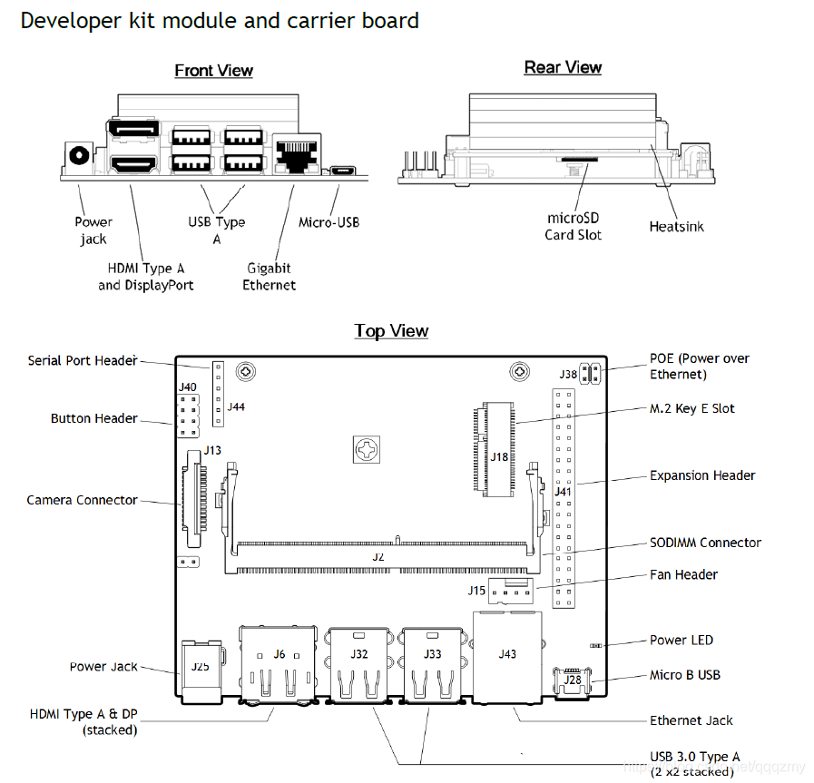

# Jetson smart fan
an open source pwm fan program for nvidia jetson devices. It read the temperature from thermal and choose a suite pwm levelfor onboard pwm fan.  
It's easy to customize the multiple pwm level with a simple json file.  
You would need a `4 pin 5v pwm fan` for this to make sense. a 3 pin fan wouldn't support the pwm, and will run with a default level.  
Strongely Recommend to use with a `4A power supply`.



jetson smart fan is implemented in c/c++ language and still under dev. Pull requests are welcome.

# Sync code
Using git and run 
```
git clone https://github.com/kiah2008/jetson_smart_fan.git
```

# Installation
## Compile

you can build it with jetson nano directly after uploading the sources.  
PS. you can also download [cross-compile toolchain](http://releases.linaro.org/components/toolchain/binaries/7.3-2018.05/aarch64-linux-gnu/gcc-linaro-7.3.1-2018.05-x86_64_aarch64-linux-gnu.tar.xz) and using aarch64 gcc to compile and build the target.   

suggest to compiling onboard.

### Setup environment if cross-compile necessrary.
```
#!/bin/bash

#export SYS_ROOT=/mnt/nano_rootfs
export CROSS_ROOT=/home/kiah/worktmp/rootfs-nano
# toolchain extract path
export CROSS_TC_ROOT=/home/kiah/worktmp/aarch64_tc/gcc-linaro-7.3.1-2018.05-x86_64_aarch64-linux-gnu
export CROSS_COMPILE=${CROSS_TC_ROOT}/bin
export CC=${CROSS_COMPILE}/aarch64-linux-gnu-gcc
export CXX=${CROSS_COMPILE}/aarch64-linux-gnu-g++
export LD=${CROSS_COMPILE}/aarch64-linux-gnu-ld
export AR=${CROSS_COMPILE}/aarch64-linux-gnu-ar
export AS=${CROSS_COMPILE}/aarch64-linux-gnu-as
export RANLIB=${CROSS_COMPILE}/aarch64-linux-gnu-ranlib
export NVCC=${SYS_ROOT}/usr/local/cuda/bin/nvcc
export LD_LIBRARY_PATH=$LD_LIBRARY_PATH:$SYSROOT/usr/lib/aarch64-linux-gnu:$SYSROOT/lib/aarch64-linux-gnu:$SYSROOT/lib
export LC_ALL=C
export LD_LIBRARY_PATH=$LD_LIBRARY_PATH:${CROSS_TC_ROOT}/aarch64-linux-gnu/lib64:${CROSS_TC_ROOT}/aarch64-linux-gnu/sysroot/lib
```

using `cmake` to help the construction.  
command as below:  
```
mkdir build
cd build && cmake .. -DCMAKE_INSTALL_PREFIX=/etc/jetson_smart_fan
make
```

## Install 
It would install bin and conf into the path specificed during configure(aka CMAKE_INSTALL_PREFIX above) automaticlly.  
ps. you may use `sudo` to fix the copy permission issue.
```
sudo make install
```

# Configure
You can customize the PWM level in json, and see more details  in config/pwm_fan.json.

```
    [
        {
            "temp_thsd": 25,
            "sample_interval": 1.0,
            "dev_level": 0
        },
        {
            "temp_thsd": 38.5,
            "sample_interval": 0.8,
            "dev_level": 45
        },
        {
            "temp_thsd": 42,
            "sample_interval": 0.5,
            "dev_level": 55
        },
        {
            "temp_thsd": 46,
            "sample_interval": 0.5,
            "dev_level": 90
        },
        {
            "temp_thsd": 55,
            "sample_interval": 0.25,
            "dev_level": 120
        },
        {
            "temp_thsd": 60,
            "sample_interval": 0.25,
            "dev_level": 150
        }
        ,
        {
            "temp_thsd": 100,
            "sample_interval": 0.25,
            "dev_level": 255
        }
    ]
```

# Run
## Start service
after install, the service unit will be under /lib/systemd folders.
you can start the service by manual.

```
sudo systemctl daemon-reload
sudo systemctl start jetson_smart_fan
```
## Start service during booting
```
sudo systemctl enable jetson_smart_fan
```

## Check service status

```
kiah@kiah-jetson:/etc/jetson_smart_fan$ systemctl status jetson_smart_fan
● jetson_smart_fan.service - jetson_stats service
   Loaded: loaded (/lib/systemd/system/jetson_smart_fan.service; enabled; vendor preset: enabled)
   Active: active (running) since Mon 2021-05-31 15:55:30 CST; 32min ago
 Main PID: 16306 (jetson_smart_fa)
    Tasks: 2 (limit: 4177)
   CGroup: /system.slice/jetson_smart_fan.service
           └─16306 /etc/jetson_smart_fan/jetson_smart_fan -s -f /etc/jetson_smart_fan/pwm_fan.json

5月 31 15:55:30 kiah-jetson jetson_smart_fan[16306]: using rec {38.500000c,0.800000s,45} w/ temp 38.000000
5月 31 15:55:30 kiah-jetson jetson_smart_fan[16306]: using dev level 45
5月 31 16:04:58 kiah-jetson jetson_smart_fan[16306]: using rec {42.000000c,0.500000s,60} w/ temp 40.000000
5月 31 16:04:58 kiah-jetson jetson_smart_fan[16306]: using dev level 60
5月 31 16:07:00 kiah-jetson jetson_smart_fan[16306]: using rec {38.500000c,0.800000s,45} w/ temp 38.000000
5月 31 16:07:00 kiah-jetson jetson_smart_fan[16306]: using dev level 45
5月 31 16:24:27 kiah-jetson jetson_smart_fan[16306]: using rec {42.000000c,0.500000s,60} w/ temp 40.000000
5月 31 16:24:27 kiah-jetson jetson_smart_fan[16306]: using dev level 60
5月 31 16:28:06 kiah-jetson jetson_smart_fan[16306]: using rec {38.500000c,0.800000s,45} w/ temp 38.000000
5月 31 16:28:06 kiah-jetson jetson_smart_fan[16306]: using dev level 45
```


# SOURCE CODE CONTRIBUTION
Your contribution to jetson smart fan Project is much appreciated.  
Please feel free to open issues or pull requests on this Repository.  
If you find this tool useful, you can support me with a star.
